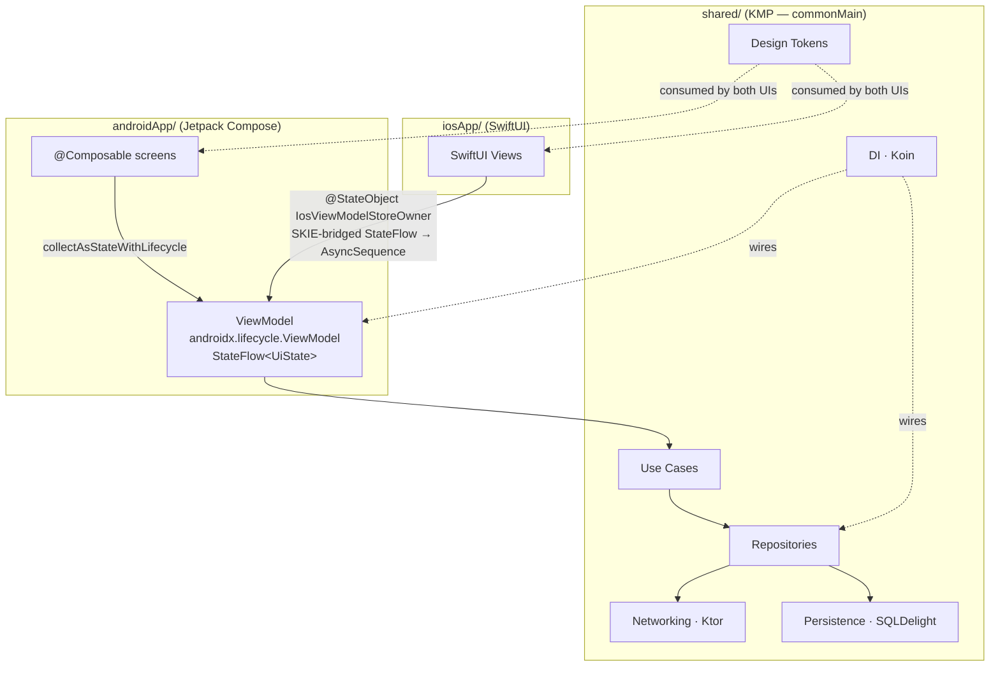

<!-- generated-by: gsd-doc-writer -->
# Architecture

## System overview

Skeleton is a Kotlin Multiplatform (KMP) mobile-app skeleton that shares all business logic — ViewModels, use cases, repositories, networking, persistence, DI, and design tokens — in a single `shared/` Gradle module. Each platform renders state using its native UI idiom: Jetpack Compose on Android and SwiftUI on iOS. The architectural style is **MVVM with unidirectional data flow (UDF)**: a shared `ViewModel` exposes `StateFlow<UiState>`, platform UIs collect that state and send events back via plain method calls, and no UI layer ever mutates state directly.

---

## Component diagram



---

## Data flow

A typical request travels through the system in the following order:

1. **User interaction** — A Composable or SwiftUI view calls a method on the shared `ViewModel` (e.g., `onAppear(userId:)`, `onSubmit(input:)`).
2. **ViewModel** — Receives the event, sets `UiState.Loading`, then delegates to a **Use Case**.
3. **Use Case** — Contains the business rule; delegates reads/writes to a **Repository**.
4. **Repository** — Decides whether to fetch from the **Ktor** HTTP client or the local **SQLDelight** database and returns a domain model.
5. **ViewModel** — Receives the result, maps it to `UiState.Ready` or `UiState.Error`, and emits on `StateFlow`.
6. **UI** — Android collects the flow with `collectAsStateWithLifecycle()`; iOS iterates the SKIE-generated `AsyncSequence` inside a `.task {}` modifier. Both render the new state; neither mutates it.

Direction of dependency is strictly one-way: UI → ViewModel → Use Case → Repository → (Network / DB). No layer imports from a layer above it.

---

## Key abstractions

| Abstraction | File path | Description |
|---|---|---|
| `ViewModel` | `shared/src/commonMain/kotlin/dev/skeleton/ui/<feature>/` | Extends `androidx.lifecycle.ViewModel`; exposes `StateFlow<UiState>`; one per screen |
| `UiState` | Nested inside each `ViewModel` | `sealed interface` with `Loading`, `Ready`, and `Error` variants |
| Use cases | `shared/src/commonMain/kotlin/dev/skeleton/domain/usecases/` | Single-responsibility callable objects encapsulating one business rule |
| Repositories | `shared/src/commonMain/kotlin/dev/skeleton/data/` | Abstractions over network and local DB; owned by the domain layer |
| `DesignTokens` | `shared/src/commonMain/kotlin/dev/skeleton/theme/DesignTokens.kt` | Kotlin `object` holding all color, typography, spacing, and radius primitives as platform-neutral values |
| `LightColors` / `DarkColors` | `shared/src/commonMain/kotlin/dev/skeleton/theme/DesignTokens.kt` | ARGB `Long` color palettes; consumed by platform adapters at runtime |
| `IosViewModelStoreOwner` | `iosApp/iosApp/Common/IosViewModelStoreOwner.swift` | Swift class conforming to `ObservableObject` + `ViewModelStoreOwner`; hosts the shared `ViewModel` lifecycle on iOS |
| Koin modules | `shared/src/commonMain/kotlin/dev/skeleton/di/` | Dependency injection wiring; `startKoin` is called from each platform app entrypoint |

---

## Directory structure rationale

```
skeleton/
├─ shared/                            # KMP module — the single source of truth
│  └─ src/
│     ├─ commonMain/kotlin/dev/skeleton/
│     │  ├─ theme/      # Design tokens: colors, typography, spacing, radius
│     │  ├─ ui/         # One subdirectory per screen; ViewModel + UiState
│     │  ├─ domain/     # Use cases and domain models
│     │  ├─ data/       # Repositories, Ktor networking, SQLDelight persistence
│     │  └─ di/         # Koin DI modules
│     ├─ androidMain/   # expect/actual implementations that need Android APIs
│     ├─ iosMain/       # expect/actual implementations that need iOS APIs
│     └─ commonTest/    # ViewModel and use-case unit tests (kotlin.test)
├─ androidApp/                        # Compose UI; depends on :shared
│  └─ src/main/…/theme/AppTheme.kt   # Maps shared tokens → MaterialTheme
├─ iosApp/                            # Xcode project; consumes shared via SPM
│  └─ iosApp/
│     ├─ Common/IosViewModelStoreOwner.swift
│     └─ Theme/AppTheme.swift         # Maps shared tokens → SwiftUI Color/Font
├─ compose-multiplatform-core/        # READ-ONLY reference — upstream AndroidX/Compose source
├─ gradle/libs.versions.toml          # Single source of truth for all dependency versions
├─ README.md
└─ architecture.md                    # Original ADR (hand-written)
```

- `shared/` — Everything that must not be duplicated lives here. Platform-specific code enters only through `expect`/`actual` declarations.
- `androidApp/` — Compose entrypoint, theme adapter, and navigation. Contains no business logic.
- `iosApp/` — SwiftUI entrypoint, theme adapter, and `NavigationStack` wiring. Contains no business logic.
- `compose-multiplatform-core/` — Checked out locally for IDE navigation and source-level reference to AndroidX/Compose internals. Not imported directly; always depend on published Maven artifacts instead.

---

## Tech stack

| Layer | Choice | Notes |
|---|---|---|
| Shared language | Kotlin (KMP) | Targets `commonMain`, `androidMain`, `iosMain` |
| UI-layer pattern | MVVM + `androidx.lifecycle.ViewModel` | Pinned at 2.10.0; the artifact is KMP-capable since 2.8.0 |
| Shared state primitive | `StateFlow<UiState>` + UDF | `MutableStateFlow` stays private to the ViewModel |
| Shared HTTP | Ktor Client | KMP-canonical networking library |
| Shared DB | SQLDelight | Alternative: Room-KMP if a Jetpack-heavy stack is preferred |
| Shared DI | Koin | Hilt is not KMP-compatible (per Google's official KMP ViewModel guide) |
| Shared async | Coroutines + `viewModelScope` | Standard Kotlin reactive primitives |
| Serialization | kotlinx.serialization | Used for network payloads |
| Date/time | kotlinx-datetime | KMP-safe replacement for `java.time` |
| Design tokens | `shared/.../theme/DesignTokens.kt` | Platform-neutral `Long`/`Float`/`Int` primitives; no Compose or SwiftUI types |
| Android UI | Jetpack Compose + Material 3 | `AppTheme.kt` maps shared tokens to `ColorScheme` and `Typography` |
| Android nav | Navigation 3 | Type-safe routes |
| Android image | Coil 3 | KMP-capable |
| Android Flow collection | `collectAsStateWithLifecycle()` | Lifecycle-aware; from `androidx.lifecycle:lifecycle-runtime-compose` |
| iOS UI | SwiftUI | Native; `AppTheme.swift` maps shared tokens to `Color` and `Font` |
| iOS nav | `NavigationStack` | Native iOS 16+ |
| iOS Flow interop | SKIE (Touchlab) | Bridges `StateFlow` → `AsyncSequence`; Kotlin enums → Swift enums |
| iOS ViewModel host | `IosViewModelStoreOwner` | Per the official Google KMP ViewModel guide and Fruitties sample |
| iOS distribution | Swift Package Manager (SPM) | CocoaPods is being deprecated for KMP |
| Build | Gradle KMP plugin | All version coordinates in `gradle/libs.versions.toml` |

---

## Layering rules

1. **Dependency direction:** UI → ViewModel → Use Case → Repository → (Network / DB). No reverse dependencies.
2. **`commonMain` is platform-blind.** It may not import `android.*` or `UIKit`. Platform glue enters via `expect`/`actual`.
3. **No business logic in `androidApp/` or `iosApp/`.** Those modules wire DI, adapt themes, and render state — nothing else.
4. **No raw visual literals in UI code.** All colors, font sizes, weights, spacing, and corner radii come from `shared/.../theme/DesignTokens.kt`.
5. **One ViewModel per screen.** State shared across screens lives in a Repository.
6. **State down, events up.** Views call plain methods on the ViewModel; the ViewModel never holds a reference to any View or callback.

---

## Relationship to `compose-multiplatform-core/`

This directory is the JetBrains fork of AndroidX — the upstream source for `lifecycle`, `compose-runtime`, `navigation`, `room`, and `paging`. It is present for **reference only**. The project depends on the published Maven artifacts (coordinates pinned in `gradle/libs.versions.toml`), never on the local source tree.

Useful navigation entry points within that tree:

- `compose-multiplatform-core/lifecycle/` — AndroidX `ViewModel` source extended by this project
- `compose-multiplatform-core/compose/runtime/` — recomposition engine behind `collectAsStateWithLifecycle()`
- `compose-multiplatform-core/navigation/` — Navigation 3 (typed routes)
- `compose-multiplatform-core/MULTIPLATFORM.md` — JetBrains KMP setup notes

---

## References

1. [Common ViewModel — Kotlin Multiplatform Documentation](https://kotlinlang.org/docs/multiplatform/compose-viewmodel.html)
2. [Set up ViewModel for KMP — Android Developers](https://developer.android.com/kotlin/multiplatform/viewmodel)
3. [Recommendations for Android architecture — Android Developers](https://developer.android.com/topic/architecture/recommendations)
4. [UI layer / State production — Android Developers](https://developer.android.com/topic/architecture/ui-layer/state-production)
5. [StateFlow and SharedFlow — Android Developers](https://developer.android.com/kotlin/flow/stateflow-and-sharedflow)
6. [Fruitties — official Google KMP sample](https://github.com/android/kotlin-multiplatform-samples/tree/main/Fruitties)
7. [SKIE — Kotlin/Swift interop bridge](https://skie.touchlab.co/)
